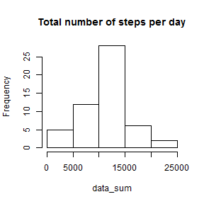

 Loading and preprocesing data


```r
data<-read.csv("activity.csv", header = TRUE, stringsAsFactors=FALSE)
data1<-read.csv("activity.csv", header = TRUE, stringsAsFactors=FALSE)
data<-na.omit(data)
data$date<- as.Date(data$date, "%Y-%m-%d")
data1$date<- as.Date(data1$date, "%Y-%m-%d")
```
 What is mean total number of steps taken per day?

```r
data_sum<-unlist(lapply(split(data$step,data$date),sum))
hist(data_sum, main = "Total number of steps per day")
```

 

```r
data_mean<-unlist(lapply(split(data$step,data$date),mean))
data_median <- unlist(lapply(split(data$step,data$date),median))
data_mean<-data.frame(data_mean)
data_median<-data.frame(data_median)
rep<-cbind(data_mean,data_median)
names(rep)<-c("mean", "median")
rep
```

```
##                  mean median
## 2012-10-02  0.4375000      0
## 2012-10-03 39.4166667      0
## 2012-10-04 42.0694444      0
## 2012-10-05 46.1597222      0
## 2012-10-06 53.5416667      0
## 2012-10-07 38.2465278      0
## 2012-10-09 44.4826389      0
## 2012-10-10 34.3750000      0
## 2012-10-11 35.7777778      0
## 2012-10-12 60.3541667      0
## 2012-10-13 43.1458333      0
## 2012-10-14 52.4236111      0
## 2012-10-15 35.2048611      0
## 2012-10-16 52.3750000      0
## 2012-10-17 46.7083333      0
## 2012-10-18 34.9166667      0
## 2012-10-19 41.0729167      0
## 2012-10-20 36.0937500      0
## 2012-10-21 30.6284722      0
## 2012-10-22 46.7361111      0
## 2012-10-23 30.9652778      0
## 2012-10-24 29.0104167      0
## 2012-10-25  8.6527778      0
## 2012-10-26 23.5347222      0
## 2012-10-27 35.1354167      0
## 2012-10-28 39.7847222      0
## 2012-10-29 17.4236111      0
## 2012-10-30 34.0937500      0
## 2012-10-31 53.5208333      0
## 2012-11-02 36.8055556      0
## 2012-11-03 36.7048611      0
## 2012-11-05 36.2465278      0
## 2012-11-06 28.9375000      0
## 2012-11-07 44.7326389      0
## 2012-11-08 11.1770833      0
## 2012-11-11 43.7777778      0
## 2012-11-12 37.3784722      0
## 2012-11-13 25.4722222      0
## 2012-11-15  0.1423611      0
## 2012-11-16 18.8923611      0
## 2012-11-17 49.7881944      0
## 2012-11-18 52.4652778      0
## 2012-11-19 30.6979167      0
## 2012-11-20 15.5277778      0
## 2012-11-21 44.3993056      0
## 2012-11-22 70.9270833      0
## 2012-11-23 73.5902778      0
## 2012-11-24 50.2708333      0
## 2012-11-25 41.0902778      0
## 2012-11-26 38.7569444      0
## 2012-11-27 47.3819444      0
## 2012-11-28 35.3576389      0
## 2012-11-29 24.4687500      0
```
What is the average daily activity pattern?

```r
interval<-split(data$steps,data$interval)
interval<-unlist(lapply(interval,mean))
plot(interval,type="l", xlab="interval", ylab="average number of steps taken across all days")
```

 

```r
#
```
Which 5-minute interval, on average across all the days in the dataset,
contains the maximum number of steps?


```r
which.max(interval)[[1]]
```

```
## [1] 104
```

##Missing values:
total number of missing values in the dataset

```r
sum(is.na(data1))
```

```
## [1] 2304
```

Devise a strategy for filling in all of the missing values in the dataset.

My strategy is simple. For step cells with missing values I will input the mean for that 5-minute interval.

Creating a new dataset that is equal to the original dataset but with the
missing data filled in.


```r
#creating data frame with average steps for each interval
avereage<-split(data$steps,data$interval)
avereage<-lapply(avereage,mean)
n<-names(avereage)
l<-unlist(avereage, use.names=FALSE)
class(n)<-"numeric"
avereage<-cbind(n,l)
# filling in NA cells
for (i in 1:dim(data1)[1]){
        if (is.na(data1[i,1])==TRUE) {
                data1[i,1]=avereage[which(data1[i,3]==avereage[,1]),2]
        }
        
}


##histogram of the total number of steps taken each day
data1_sum<-unlist(lapply(split(data1$step,data1$date),sum))
hist(data1_sum, main = "Total number of steps per day")
```

 

```r
data1_mean<-unlist(lapply(split(data1$step,data1$date),mean))
data1_median <- unlist(lapply(split(data1$step,data1$date),median))
data1_mean<-data.frame(data1_mean)
data1_median<-data.frame(data1_median)
rep1<-cbind(data1_mean,data1_median)
names(rep)<-c("mean", "median")
rep1
```

```
##            data1_mean data1_median
## 2012-10-01 37.3825996     34.11321
## 2012-10-02  0.4375000      0.00000
## 2012-10-03 39.4166667      0.00000
## 2012-10-04 42.0694444      0.00000
## 2012-10-05 46.1597222      0.00000
## 2012-10-06 53.5416667      0.00000
## 2012-10-07 38.2465278      0.00000
## 2012-10-08 37.3825996     34.11321
## 2012-10-09 44.4826389      0.00000
## 2012-10-10 34.3750000      0.00000
## 2012-10-11 35.7777778      0.00000
## 2012-10-12 60.3541667      0.00000
## 2012-10-13 43.1458333      0.00000
## 2012-10-14 52.4236111      0.00000
## 2012-10-15 35.2048611      0.00000
## 2012-10-16 52.3750000      0.00000
## 2012-10-17 46.7083333      0.00000
## 2012-10-18 34.9166667      0.00000
## 2012-10-19 41.0729167      0.00000
## 2012-10-20 36.0937500      0.00000
## 2012-10-21 30.6284722      0.00000
## 2012-10-22 46.7361111      0.00000
## 2012-10-23 30.9652778      0.00000
## 2012-10-24 29.0104167      0.00000
## 2012-10-25  8.6527778      0.00000
## 2012-10-26 23.5347222      0.00000
## 2012-10-27 35.1354167      0.00000
## 2012-10-28 39.7847222      0.00000
## 2012-10-29 17.4236111      0.00000
## 2012-10-30 34.0937500      0.00000
## 2012-10-31 53.5208333      0.00000
## 2012-11-01 37.3825996     34.11321
## 2012-11-02 36.8055556      0.00000
## 2012-11-03 36.7048611      0.00000
## 2012-11-04 37.3825996     34.11321
## 2012-11-05 36.2465278      0.00000
## 2012-11-06 28.9375000      0.00000
## 2012-11-07 44.7326389      0.00000
## 2012-11-08 11.1770833      0.00000
## 2012-11-09 37.3825996     34.11321
## 2012-11-10 37.3825996     34.11321
## 2012-11-11 43.7777778      0.00000
## 2012-11-12 37.3784722      0.00000
## 2012-11-13 25.4722222      0.00000
## 2012-11-14 37.3825996     34.11321
## 2012-11-15  0.1423611      0.00000
## 2012-11-16 18.8923611      0.00000
## 2012-11-17 49.7881944      0.00000
## 2012-11-18 52.4652778      0.00000
## 2012-11-19 30.6979167      0.00000
## 2012-11-20 15.5277778      0.00000
## 2012-11-21 44.3993056      0.00000
## 2012-11-22 70.9270833      0.00000
## 2012-11-23 73.5902778      0.00000
## 2012-11-24 50.2708333      0.00000
## 2012-11-25 41.0902778      0.00000
## 2012-11-26 38.7569444      0.00000
## 2012-11-27 47.3819444      0.00000
## 2012-11-28 35.3576389      0.00000
## 2012-11-29 24.4687500      0.00000
## 2012-11-30 37.3825996     34.11321
```

```r
#What is the impact of imputing missing data on the estimates of the total
#daily number of steps?

mean_impact <- rep[,1]-rep1[,1]
```

```
## Warning in rep[, 1] - rep1[, 1]: longer object length is not a multiple of
## shorter object length
```

```r
summary(mean_impact)
```

```
##      Min.   1st Qu.    Median      Mean   3rd Qu.      Max. 
## -73.15000 -10.44000   0.33680  -0.00544   8.02800  70.78000
```

```r
 #as we can see replacing the "NA" value using this method have big impact of output data, the difference between output average of steps per day can vary up to 70 steps! (min is 73)
# the conclusion is that if we want to replace NA values we have to discover suitable procedure for that.
```
